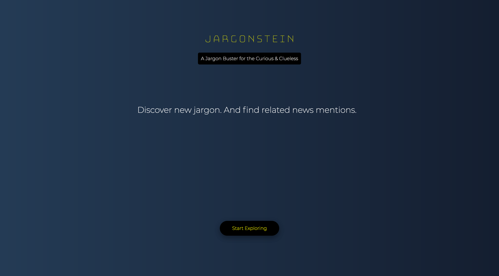

# Jargonstein

An app that randomly displays a jargon and related news mentions.

The app uses seed data of jargons cobbled together from various sources and does not purport to be authoritative. 

It uses the api from https://newsapi.org/ to retrieve news mentions related to a jargon.

More than being a complete app, therefore, this is an attempt to learn and incorporate fundamental concepts related to the following themes:

* React development
  * Stateful class containers vs stateless functional presentational components (quite a mouthful I agree!)
  * Props and PropTypes
  * Modularity
  * Routing
  * Fetch
* Heroku deployment
* Testing
* Javascript coding and refactoring
* CSS

This app was bootstrapped with [Create React App](https://github.com/facebookincubator/create-react-app).

## Getting Started

To view the app, head over to:
https://limitless-fortress-43752.herokuapp.com/

To get a copy of the project up and running on your local machine for development and testing purposes enter the following on the command line:

> git clone https://github.com/nasturtus/jargonstein.git

To run the app locally:

> yarn start

To run tests:

> yarn test

# Dependencies

Import the following:

* "react"
* "react-router-dom"
* "react-typing-animation"
* "enzyme"

# Authors and Acknowledgments

Developed as part of Jumpstart coding bootcamp, with loads of support from the cohort and guidance from the following instructors:

https://github.com/songguoqiang
https://github.com/davified

# License

This project is licensed under the MIT License - see the LICENSE.md file for details
